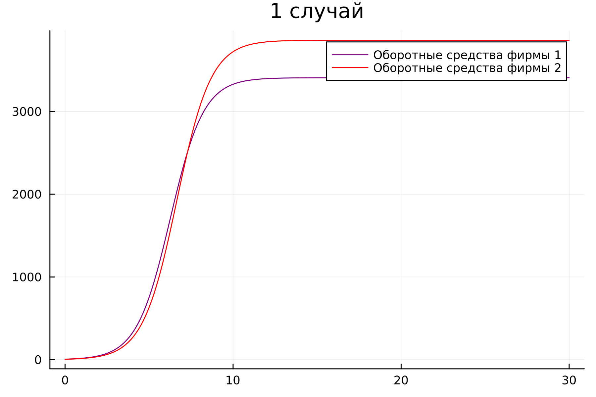

---
## Front matter
title: "Лабораторная работа № 8"
subtitle: "Модель конкуренции двух фирм"
author: "Покрас Илья Михайлович"

## Generic otions
lang: ru-RU
toc-title: "Содержание"

## Bibliography
bibliography: bib/cite.bib
csl: pandoc/csl/gost-r-7-0-5-2008-numeric.csl

## Pdf output format
toc: true # Table of contents
toc-depth: 2
lof: true # List of figures
lot: false
fontsize: 12pt
linestretch: 1.5
papersize: a4
documentclass: scrreprt
## I18n polyglossia
polyglossia-lang:
  name: russian
  options:
	- spelling=modern
	- babelshorthands=true
polyglossia-otherlangs:
  name: english
## I18n babel
babel-lang: russian
babel-otherlangs: english
## Fonts
mainfont: PT Serif
romanfont: PT Serif
sansfont: PT Sans
monofont: PT Mono
mainfontoptions: Ligatures=TeX
romanfontoptions: Ligatures=TeX
sansfontoptions: Ligatures=TeX,Scale=MatchLowercase
monofontoptions: Scale=MatchLowercase,Scale=0.9
## Biblatex
biblatex: true
biblio-style: "gost-numeric"
biblatexoptions:
  - parentracker=true
  - backend=biber
  - hyperref=auto
  - language=auto
  - autolang=other*
  - citestyle=gost-numeric
## Pandoc-crossref LaTeX customization
figureTitle: "Рис."
tableTitle: "Таблица"
listingTitle: "Листинг"
lofTitle: "Список иллюстраций"
lotTitle: "Список таблиц"
lolTitle: "Листинги"
## Misc options
indent: true
header-includes:
  - \usepackage{indentfirst}
  - \usepackage{float} # keep figures where there are in the text
  - \floatplacement{figure}{H} # keep figures where there are in the text
---

# Цель работы

Целью данной работы является построение модели  конкуренции двух фирм.

# Задание

1. Построить графики изменения оборотных средств фирмы 1 и фирмы 2 без учета постоянных издержек и с веденной нормировкой для случая 1.

2. Построить графики изменения оборотных средств фирмы 1 и фирмы 2 без учета постоянных издержек и с веденной нормировкой для случая 2.

# Ход выполнения лабораторной работы:

## Теоретическое введение 

Рассмотрим две фирмы, производящие взаимозаменяемые товары одинакового качества и находящиеся в одной рыночной нише. Последнее означает, что у потребителей в этой нише нет априорных предпочтений, и они приобретут тот или иной товар, не обращая внимания на знак фирмы. В этом случае, на рынке устанавливается единая цена, которая определяется балансом суммарного предложения и спроса. Иными словами, в рамках нашей модели конкурентная борьба ведётся только рыночными методами. То есть, конкуренты могут влиять на противника путем изменения параметров своего производства: себестоимость, время цикла, но не могут прямо вмешиваться в ситуацию на рынке («назначать» цену или влиять на потребителей какимлибо иным способом.)

## Код на Julia:

Подключим библиотеки для дальнейшей дальнейшей работы. Далее создадим переменные критической стоимости продукта, длительности производственного цикла фирмы 1, себестоимости продукта у фирмы 1, длительности производственного цикла фирмы 2, себестоимости продукта у фирмы 2, числа потребителей производимого продукта и максимальной потребности одного человека в продукте в единицу времени(@fig:001).

{#fig:001}

Создадим  ОДУ с помощью Differential Equations системы (@fig:002).

{#fig:002}

С помощью solve получим решения ОДУ и сохраним данные решений в отдельные вектора(@fig:003).

{#fig:003}

Визуализируем решение с помощью Plots(@fig:004).

{#fig:004}

Результат(Julia) (@fig:005 - @fig:006)

{#fig:005}

{#fig:006}

## Код на OpenModelica

Для начала создадим переменные критической стоимости продукта, длительности производственного цикла фирмы 1, себестоимости продукта у фирмы 1, длительности производственного цикла фирмы 2, себестоимости продукта у фирмы 2, числа потребителей производимого продукта и максимальной потребности одного человека в продукте в единицу времени. Далее запишем ОДУ (@fig:007 - @fig:08).

{#fig:007}

{#fig:008}

Результат(Julia) (@fig:009 - @fig:010)

{#fig:009}

{#fig:010}

# Вывод

В результате проделанной работы был написан код на Julia и OpenModelica и были построены математические модели конкуренции двух фирм.

# Список Литературы

[1] Задания к лабораторной работе №7 (по вариантам) - https://esystem.rudn.ru/pluginfile.php/1971673/mod_resource/content/2/Задание%20к%20лабораторной%20работе%20№%207.pdf

[2] Руководство по выполнению лабораторной работы №7 - https://esystem.rudn.ru/pluginfile.php/1971672/mod_resource/content/2/Лабораторная%20работа%20№%207.pdf